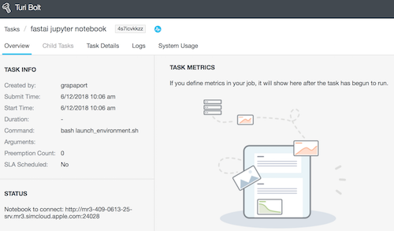
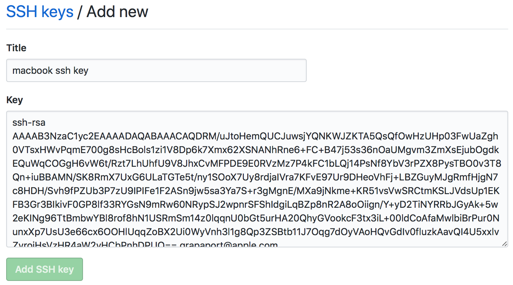
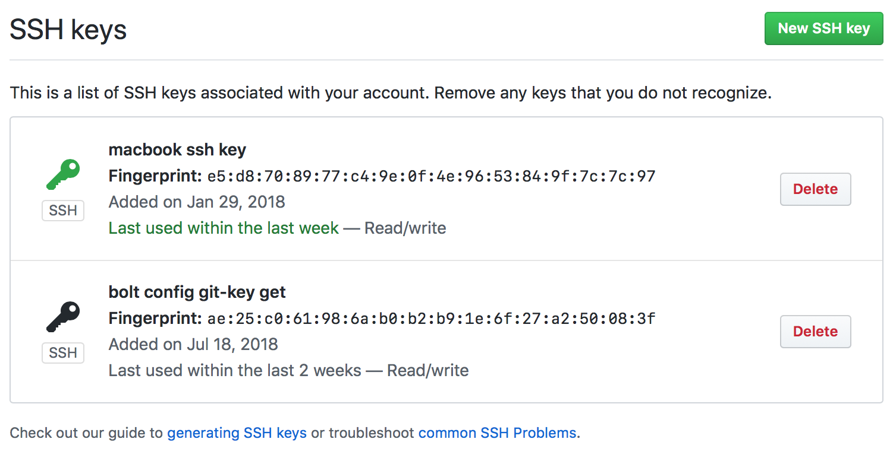

# fastai-on-bolt

## Introduction

Inspired by [Working with course.fast.ai on Simcloud](https://quip-apple.com/XaMeALyC8xsR),
this repo aims at running the fast.ai course materials on [Turi Bolt](https://bolt.apple.com/docs).

It was created to support [taking the fast.ai course together](https://quip-apple.com/tI9PA1sYA3BK#PES9CAxSx7k),
by the Israeli ML team, ML-IL. [Join us: adir://joingroup/1234288](adir://joingroup/1234288)


## How It Works

First, add yourself to `simcloud` OD group
([adir://groups/562143](adir://groups/562143)),
and give it ~5 hours to propagate.

To run it, simply clone the repository and run a single script:

<a id="clone"></a>

```bash
$ git clone git@github.pie.apple.com:grapaport/fastai-on-bolt.git
$ cd fastai-on-bolt
$ ./fastai_on_bolt.sh
```
If you get an error during `git clone`, go through the [cloning using SSH](#ssh) instructions. The PIE GitHub (where this repo is currently hosted) allows cloning only using SSH.

The script will show you a the `Live dashboard` link (something similar to [https://bolt.apple.com/tasks/4s7icvkkzz/](https://bolt.apple.com/tasks/4s7icvkkzz/) ).

Open it in Safari to see the Jupyter Notebook server address on the Status box in the left-hand side (something like `Notebook to connect: http://mr3-409-0613-25-srv.mr3.simcloud.apple.com:24028`).




## What Does This Repo Contain

* `README.md` - this document.
* `fastai_on_bolt.sh` - script to install bolt and launch environment .

* `launch_environment` - task that launches the `fast.ai` environment from the bolt template.
    
* `cook_bundle` - task that creates the template for the bolt-compliant [fast.ai environment](https://github.com/fastai/fastai/blob/master/environment.yml). **You don't need to run this** - it is left only as a docuentation of what's included in the environment, and may be modified in the future as the course changes.

<a id="ssh"></a>

## Setting up git SSH access

### Find your public SSH key (or create one)

Check from the terminal whether you have a public SSH key.

If everything is OK, you'll see something like this:

```bash
$ file ~/.ssh/id_rsa.pub
/Users/grapaport/.ssh/id_rsa.pub: OpenSSH RSA public key
$ file ~/.ssh/id_rsa
/Users/grapaport/.ssh/id_rsa: PEM RSA private key
```

If the keys are missing, you'll see something like this:

```bash
$ file ~/.ssh/id_rsa.pub
/Users/grapaport/id_rsa.pub: cannot open `/Users/grapaport/id_rsa.pub' (No such file or directory)
```

In the latter case, create a new key:

```bash
$ ssh-keygen -f $HOME/.ssh/id_rsa -t rsa -N ''
$ file ~/.ssh/id_rsa.pub
/Users/grapaport/.ssh/id_rsa.pub: OpenSSH RSA public key
```

`cat` your **public** SSH key for copying and pasting later:

(Yes, this is my real key - I don't care! It's public!)

```bash
$ cat ~/.ssh/id_rsa.pub
ssh-rsa AAAAB3NzaC1yc2EAAAADAQABAAACAQDRM/uJtoHemQUCJuwsjYQNKWJZKTA5QsQfOwHzUHp03FwUaZgh0VTsxHWvPqmE700g8sHcBols1zi1V8Dp6k7Xmx62XSNANhRne6+FC+B47j53s36nOaUMgvm3ZmXsEjubOgdkEQuWqCOGgH6vW6t/Rzt7LhUhfU9V8JhxCvMFPDE9E0RVzMz7P4kFC1bLQj14PsNf8YbV3rPZX8PysTBO0v3T8Qn+iuBBAMN/SK8RmX7UxG6ULaTGTe5t/ny1SOoX7Uy8rdjaIVra7KFvE97Ur9DHeoVhFj+LBZGuyMJgRmfHjgN7c8HDH/Svh9fPZUb3P7zU9IPIFe1F2ASn9jw5sa3Ya7S+r3gMgnE/MXa9jNkme+KR51vsVwSRCtmKSLJVdsUp1EKFB3Gr3BIkivF0GP8lf33RYGsN9mRw60NRypSJ2wpnrSFShIdgiLqBZp8nR2A8oOiign/Y+yD2TiNYRRbJGyAk+5w2eKINg96TtBmbwYBl8rof8hN1USRmSm14z0lqqnU0bGt5urHA20QhyGVookcF3tx3iL+00ldCoAfaMwlbiBrPur0NunxXp7UsU3e66cx6OOHlUqqZoBX2Ui0WyVnh3l1g8Qp3ZSBtb11J7Oqg7dOyVAoHQvGdIv0fluzkAavQI4U5xxlvZvrojHsVzHR4aW2vHCbPnhDPUQ== grapaport@apple.com
```

### Installing your public SSH key in PIE GitHub

Go to the [add new SSH key page on PIE GitHub](https://github.pie.apple.com/settings/ssh/new).

You'll get to the `Add new` screen. Paste your **public** SSH key here. Give it some name (I chose `macbook ssh key`) and finally click on the `Add SSH key` button.



You will now see your SSH key, and [cloning using SSH](#clone) will now work.
 



## Colophon

[This repo](https://github.pie.apple.com/grapaport/fastai-on-bolt) is maintained by Guy Rapaport <[grapaport@apple.com]([grapaport@apple.com])>.
